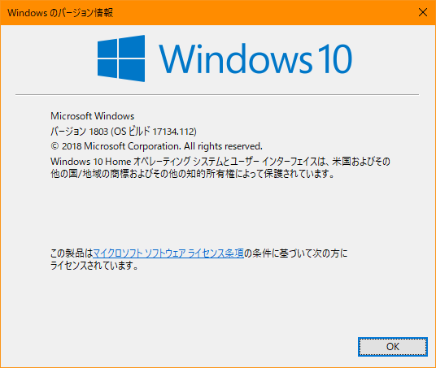
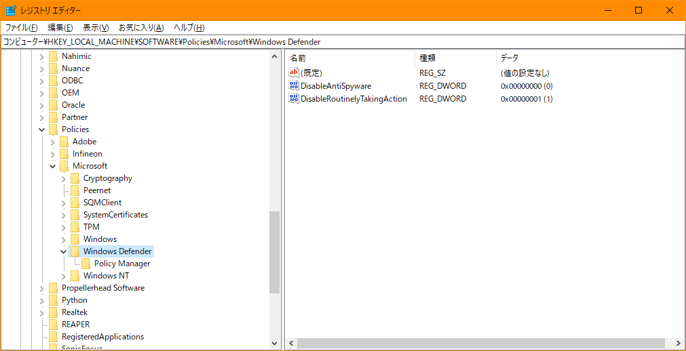
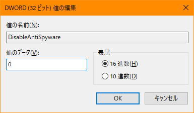

# Windows Defender で困っていたことを書いてみる(単なるリンク集に雑文を載せて)

## [ **自分の環境** ]

`Win` はWindowsキーを示しています。

多分全部Windowsの話なので、OSだけ書いておきます。

次の画像をご参照ください。

(ちょっと改変しています。これを見るには: [ `Win + R` ]で「ファイル名を指定して実行」を開いて、`winver` を入力して `Enter` をご入力してください。)

## [ **経緯** ]

Windowsの中に元々入っているウイルス対策ツールである”Windows Defender”なのだけど、最近けたたましく「ウイルス対策について」みたいな通知を大量に表示。

"Windows Defender セキュリティ センター"を確認すると、「ウイルスと脅威の防止」という項目が、「組織によって管理されています」と出て、何も検査されていない状態になっていました。

どうも、過去に入れていたサードパーティー製ウイルス対策ソフトが勝手に環境変数をいじっていたみたいなので、それについての簡単な備忘録を残しておきます。

## [ **修正方法** ]

簡単に言うと、「レジストリの編集」をしなくてはなりません。

※一応、レジストリの編集は危険なイメージがあるから気を付けて行ってほしい…

[ `Win + R` ]のキーを押して、 `regedit.exe` と打ちます。

「レジストリエディタ」が起動するので、そこで

    HKEY_LOCAL_MACHINE\SOFTWARE\Policies\Microsoft\Windows Defender

というディレクトリ(?)に移動します。

ここに、過去使えなくしたWindows Defenderについての値

    DisableAntiSpyware

の値が 0X00000001 (1) になっていると考えられます。1は無効になっているので、0にして有効にできます。

レジストリの書き換えについては、変数をダブルクリックするだけで編集画面が出てくると思います。

反対に、別のウイルス対策ソフトを入れた方はここを1にする、という流れです。

再起動すると、編集が有効になり、きちんと働くようになりました。

## [ **雑記** ]

Windowsにはよくわからない機能がまだまだたくさんあるけど、

    コントロール パネル\システムとセキュリティ\管理ツール\サービス

というコントロールパネルの操作で、内部で動いているサービスを確認できることを初めて知った…

ちょっとどのサイトだったか分かんない。しかし、ここも"Windows Defender \*\*\*"が二つぐらい実行されておらず、ダブルクリックで強制的に実行させようとしても「証明書が\*\*\*」という文言で出来なかった。ちなみに、今は実行中になっています。(以下参照)

(知らないことだらけではあります…例えば、レジストリの扱い方とかも表面的なことしか知らないですからねぇ…)

## [ **参考URL** ]

(敬称略)

* [Windows Defender が実行できない。 - こっそりと。(syo)](http://dynamic-one.com/archives/51622747.html)

* [Windows10のアップデートで復活した「Windows Defender」もう必要ないでしょ？ - Gao's Blog](http://gao-hp.net/windows10のアップデートで復活した「windows-defender」もう必要な/)

* [Windows Defender Security Center により、Symantec Endpoint Protection のインストール後に「ファイアウォールが無効になった」ことが報告される - Symantec公式](https://support.symantec.com/ja_JP/article.TECH246523.html) ⬅ 自分の中で問題となっていた"DisableAntiSpyware"を最初に発見したサイト

